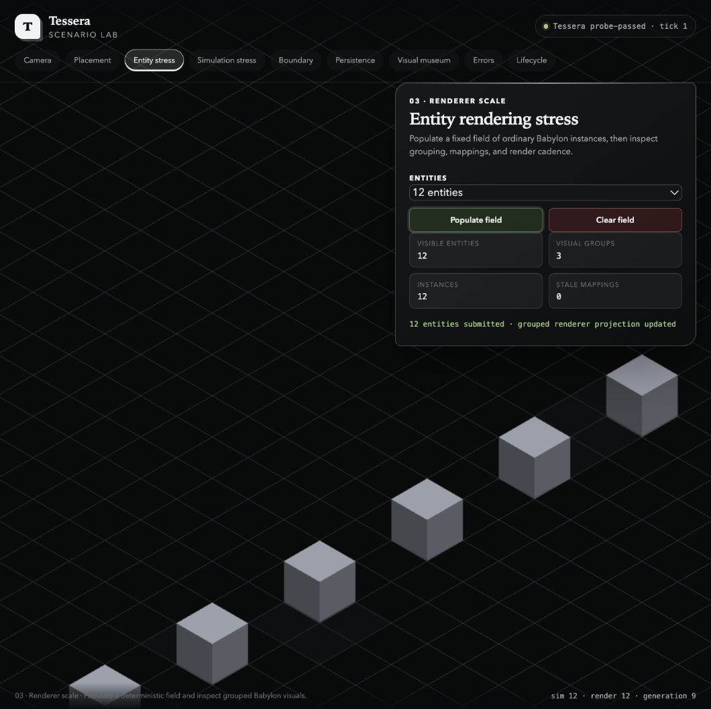
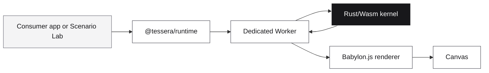

<div align="center">

# Tessera

**A deterministic Rust/Wasm runtime for browser-based isometric worlds.**

Rules live in Rust. The browser stays responsive. Babylon.js is free to rebuild
the view whenever it needs to.

<p>
  <a href="https://github.com/elviscgn/tessera/actions/workflows/ci.yml"></a>
  <a href="LICENSE"></a>
  
  
  
</p>

</div>

<p align="center">
  
</p>

<p align="center"><sub>The Scenario Lab is a working reference app for the runtime: deterministic commands, grouped Babylon visuals, persistence, diagnostics, and lifecycle checks.</sub></p>

## What Tessera is

Tessera is the runtime layer for games and tools that need a reproducible world
state without giving up a fast, disposable browser renderer. A dedicated Worker
hosts the Rust/Wasm simulation. TypeScript sends intent and reads derived data;
it does not own occupancy, entity lifetimes, randomness, or gameplay state.

The first intended consumer is Ustawi, a separate industrialisation and
city-building game. Consumer-specific economy, citizens, production chains, and
traffic belong in Ustawi rather than in the framework.

## The shape of the system



The boundary is deliberately narrow:

- Rust advances the authoritative simulation and produces events, hashes, and
  render snapshots.
- The Worker validates packed messages, owns scheduling, and transfers render
  buffers without exposing mutable Wasm memory.
- Babylon.js projects snapshots into presentation objects that can be discarded
  and rebuilt.
- The public TypeScript API exposes lifecycle, commands, camera controls,
  selection, persistence, and diagnostics.

## What works today

| Area              | Current capability                                                                                                                       |
| ----------------- | ---------------------------------------------------------------------------------------------------------------------------------------- |
| Simulation        | Fixed-tick Rust kernel, seeded randomness, generational entities, replay metadata, canonical state hashes                                |
| Browser boundary  | Versioned command/event/render protocols, Worker scheduling, Wasm memory-growth recovery, transferable buffer pool                       |
| World interaction | Integer grid coordinates, occupancy and footprints, placement previews, placement/removal, picking, stable selection IDs                 |
| Rendering         | Isometric Babylon camera, grouped ordinary instances, snapshot reconciliation, reset generations, stale-map diagnostics                  |
| Persistence       | Versioned Rust-owned save DTOs, checksums, atomic load validation, in-memory and IndexedDB adapters                                      |
| Verification      | Scenario Lab, native/Wasm parity checks, Chromium functional and visual coverage, Firefox/WebKit smoke coverage, external-consumer proof |

## Try the Scenario Lab

The Scenario Lab is the fastest way to see the runtime in motion. It includes
camera and coordinate probes, placement, renderer population, exact tick
advancement, Worker/Wasm boundary metrics, persistence, canonical visual scenes,
structured errors, and lifecycle resets.

```sh
corepack enable
corepack prepare pnpm@11.19.0 --activate
pnpm install --frozen-lockfile
pnpm dev
```

Open the local URL printed by Vite. For the full pinned-toolchain setup, see
[docs/SETUP.md](docs/SETUP.md).

## A small consumer

The public entry point is intentionally small:

```ts
import { createTesseraRuntime } from '@tessera/runtime';

const canvas = document.querySelector<HTMLCanvasElement>('#world');
if (canvas === null) throw new Error('missing world canvas');

const runtime = createTesseraRuntime({
  canvas,
  scenario: { id: 'demo' },
  objectTypes: [{ id: 'foundation' }],
});

await runtime.ready;
```

The runtime owns the Worker, renderer, listeners, pending requests, and
disposal. A consumer supplies declarative object and scenario definitions plus
its preferred persistence adapter.

## Package surface

The repository currently develops one root package:

- `@tessera/runtime` — lifecycle, camera, selection, commands, persistence, and
  diagnostics.
- `@tessera/runtime/testkit` — development-only waits, reset controls, render
  inspection, and annotated test surfaces.

The package is not published to npm yet. Release checks build a local tarball,
verify its contents and export map, and install it into the external-consumer
fixture outside the workspace.

## Repository map

| Directory                                  | Purpose                                                                     |
| ------------------------------------------ | --------------------------------------------------------------------------- |
| [`rust/`](rust/)                           | Simulation kernel, protocol codecs, Wasm adapter, and native CLI            |
| [`src/`](src/)                             | Public TypeScript API, Worker integration, renderer, input, and persistence |
| [`apps/scenario-lab/`](apps/scenario-lab/) | Working reference application                                               |
| [`tests/`](tests/)                         | Unit, integration, browser, visual, and fixture tests                       |
| [`docs/`](docs/)                           | Architecture, setup, testing, contribution, and operational notes           |

## Read next

| Goal                               | Document                               |
| ---------------------------------- | -------------------------------------- |
| Understand ownership and data flow | [Architecture](docs/ARCHITECTURE.md)   |
| Install the pinned toolchain       | [Setup](docs/SETUP.md)                 |
| Run verification                   | [Testing](docs/TESTING.md)             |
| Measure performance and cleanup    | [Performance](docs/PERFORMANCE.md)     |
| Inspect browser failures           | [Observability](docs/OBSERVABILITY.md) |
| Read the wire contract             | [Protocol](docs/PROTOCOL.md)           |
| Work on the repository             | [Contributing](docs/CONTRIBUTING.md)   |
| See the delivered roadmap          | [Roadmap](docs/ROADMAP.md)             |

## v0.1 boundaries

The first release focuses on a deterministic, single-player runtime and its
browser contract. Networking, a physics engine, mobile/touch controls, a
modding system, arbitrary executable scenarios, shared-memory transport, a
WebGPU requirement, and a consumer-owned Rust plugin ABI are intentionally
outside this release.

Those boundaries can change when a real consumer need and measured evidence
justify the additional surface.

The project is licensed under the [MIT License](LICENSE).
