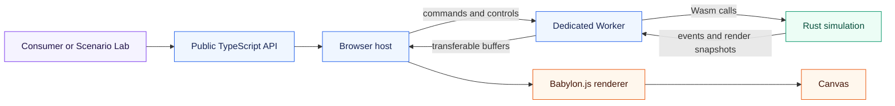
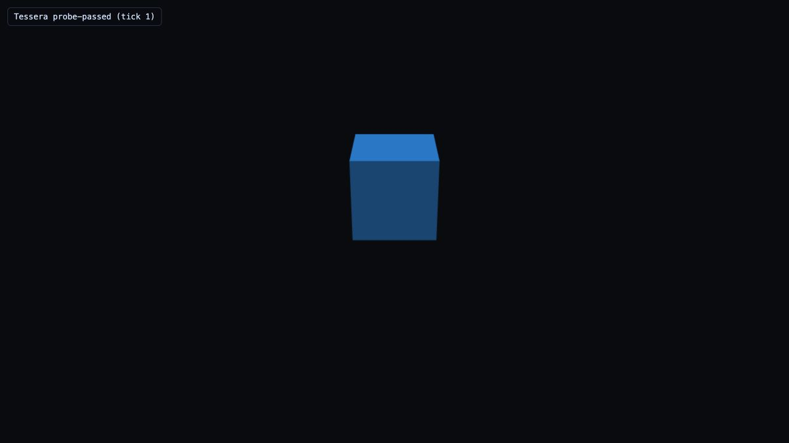

<div align="center">
  <h1>Tessera</h1>
  <p><strong>A deterministic Rust/Wasm foundation for browser-based isometric worlds.</strong></p>
  <p>
    <a href="https://github.com/elviscgn/tessera/actions/workflows/ci.yml"></a>
    <a href="LICENSE"></a>
    
    
    
  </p>
</div>

Tessera separates the rules of a world from the pixels that display it. Rust owns authoritative simulation state; a dedicated Worker carries that state into the browser; Babylon.js renders disposable snapshots of the result.

The first consumer is Ustawi, a separate industrialisation and city-building game. Tessera is being built as a reusable runtime, so Ustawi-specific economy, citizens, production chains, and traffic stay in the consumer rather than becoming framework code.

## Architecture



> **One authority.** Commands, ticks, entity lifecycles, occupancy, randomness, replays, saves, and state hashes belong to Rust. TypeScript translates intent and presents derived state; it does not maintain a second simulation.

## Foundation status

| Area                     | What is working today                                                                                                |
| ------------------------ | -------------------------------------------------------------------------------------------------------------------- |
| **Deterministic kernel** | Fixed-tick Rust simulation, seeded randomness, generational IDs, replay, and canonical state hashes                  |
| **Worker boundary**      | Versioned command, event, and render messages with packed validation                                                 |
| **Wasm transport**       | `wasm-pack --target web`, transferable render buffers, and recovery after Wasm memory growth                         |
| **Browser shell**        | Babylon.js lifecycle, readiness, diagnostics, orthographic camera, occupancy overlay, picking, and shutdown          |
| **Selection**            | Stable `slot:generation` IDs, canvas picking, screen-space bounds, and stale-generation checks                       |
| **Placement**            | Rust-owned object registries, non-mutating placement queries, preview state, placement, move, and removal            |
| **Scalable visuals**     | Visual-type groups, ordinary Babylon instances, snapshot removals, reset generations, and stale-map metrics          |
| **Persistence**          | Rust-owned versioned JSON saves, checksums, identity validation, atomic loads, replay metadata, and browser adapters |
| **Diagnostics**          | Development-only test bridge, deterministic waits, annotated snapshot captures, and reproduction manifests           |

The authoritative grid, occupancy model, selection path, declarative placement flow, grouped renderer projection, persistence boundary, and Scenario Lab laboratories are now in place. The public runtime is exercised by pinned Chromium flows and visuals, a production bridge-exclusion smoke test, and Firefox/WebKit compatibility smoke.

## Saving and loading

Save bytes are produced and validated by Rust. The browser receives them as opaque `Uint8Array` values and chooses where to keep them:

```ts
import { MemoryPersistenceAdapter } from '@tessera/runtime';

const adapter = new MemoryPersistenceAdapter();
const bytes = await runtime.save();
await adapter.write(bytes);

const restored = await runtime.load(bytes);
console.log(restored.tick, restored.stateHashHex);
```

`MemoryPersistenceAdapter`, `createIndexedDbPersistenceAdapter`, `importSaveFile`, and `exportSaveFile` are convenience adapters at the public package entry point. A failed load is rejected before the active world is replaced.

## Running in the browser

<p align="center">
  
</p>

<p align="center"><em>The Scenario Lab is a deterministic workbench for camera, placement, renderer scale, persistence, diagnostics, and lifecycle checks.</em></p>

## Quick start

Tessera is developed against Node 24.18.1, pnpm 11.19.0, Rust 1.97.1, and the `wasm32-unknown-unknown` target.

```sh
corepack enable
corepack prepare pnpm@11.19.0 --activate
pnpm install --frozen-lockfile
pnpm check
```

Start the Scenario Lab during development:

```sh
pnpm dev
```

Open the local URL printed by Vite. The complete toolchain setup is in [docs/SETUP.md](docs/SETUP.md).

## External consumer proof

The repository includes a small consumer that is deliberately kept outside the
workspace package graph. It installs the exact local runtime tarball through
the public export map, builds a Vite app, runs the Worker/Wasm simulation, and
checks the Chromium flow for placement, persistence, replay metadata, and the
development test bridge.

```sh
pnpm check:package
pnpm check:external-consumer
```

The fixture pins the tarball filename and SHA-256 checksum in
[`examples/external-consumer/artifact-manifest.json`](examples/external-consumer/artifact-manifest.json).
Internal runtime paths are intentionally unavailable from the package.

## Repository map

| Directory                                  | Purpose                                                                       |
| ------------------------------------------ | ----------------------------------------------------------------------------- |
| [`rust/`](rust/)                           | Simulation kernel, protocol codecs, Wasm adapter, and native CLI              |
| [`src/`](src/)                             | Public TypeScript surface, Worker integration, renderer, and browser services |
| [`apps/scenario-lab/`](apps/scenario-lab/) | Development application for exercising the runtime                            |
| [`tests/`](tests/)                         | Unit, integration, browser, visual, and fixture tests                         |
| [`docs/`](docs/)                           | Architecture, setup, testing, contribution, and roadmap notes                 |

## Read next

| If you want to...                  | Start here                             |
| ---------------------------------- | -------------------------------------- |
| Understand ownership and data flow | [Architecture](docs/ARCHITECTURE.md)   |
| Set up the pinned toolchain        | [Setup](docs/SETUP.md)                 |
| Run or extend verification         | [Testing](docs/TESTING.md)             |
| Measure performance and cleanup    | [Performance](docs/PERFORMANCE.md)     |
| Inspect a browser failure          | [Observability](docs/OBSERVABILITY.md) |
| Make a change                      | [Contributing](docs/CONTRIBUTING.md)   |
| See what is next                   | [Roadmap](docs/ROADMAP.md)             |

## Scope

<details>
<summary>What v0.1 deliberately does not include</summary>

Networking, a physics engine, mobile or touch controls, a modding system, arbitrary executable scenarios, shared-memory transport, a WebGPU requirement, or a consumer-owned Rust plugin ABI are outside the first release. Those boundaries can change when measured evidence or a real consumer need justifies it.

</details>

The project is licensed under the [MIT License](LICENSE).
