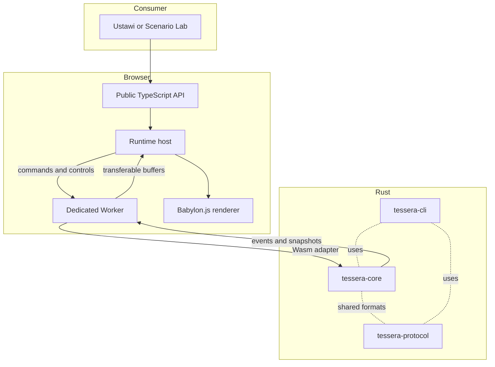
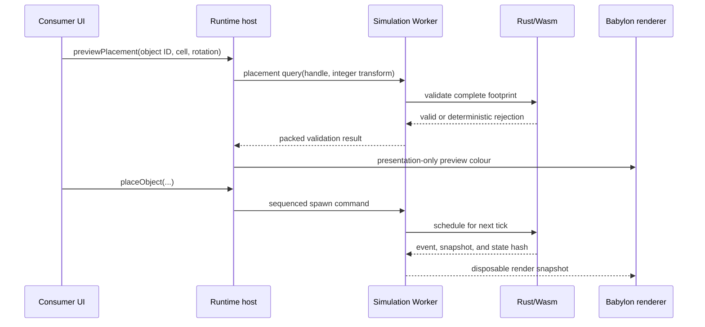

# Architecture

Tessera has one important rule: Rust owns the simulation. The browser hosts the runtime and presents its results, but it never becomes a second game state.

## Runtime responsibilities

| Part              | Responsibility                                                                                        |
| ----------------- | ----------------------------------------------------------------------------------------------------- |
| Rust core         | Authoritative simulation state and rules; native tests and CLI workflows                              |
| Simulation Worker | One Wasm instance, browser clock, command intake, tick driving, render publication, and Worker errors |
| Browser host      | Canvas, input, public lifecycle, persistence adapters, and derived presentation state                 |
| Babylon renderer  | Scene and visual resources; a disposable projection of Rust state                                     |

The browser main thread communicates with the Worker through versioned transferable buffers. The renderer receives complete snapshots and never writes into Rust memory.

Babylon.js is deliberately disposable. It can be stopped and rebuilt from a complete render snapshot without changing a tick, command result, event sequence, or state hash.

## Rust workspace

The workspace has four crates from the beginning:

- `tessera-core` contains the browser-independent simulation;
- `tessera-protocol` contains the shared wire formats and validators;
- `tessera-wasm` is the narrow Rust/JavaScript adapter;
- `tessera-cli` runs scenarios, replays, checksums, and diagnostics natively.

`tessera-core` does not depend on the protocol crate, browser bindings, Babylon.js, React, or browser storage. The protocol crate is intentionally independent of the browser so the Wasm adapter, CLI, replay tools, and contract tests use the same definitions.

The core uses a generational arena and normalized component stores. An entity is `(slot: u32, generation: u32)`, and renderer mappings reject a stale generation. Active slots are visited in a stable order. This keeps mutation straightforward while making replay, serialization, and native/Wasm comparison explicit.

Placement is indexed separately from the entity arena. A normalized `Footprint` stores sorted integer offsets, and an `OccupancyGrid` maps each expanded `(x, z, elevation)` cell to one generational entity ID. Spawn, move, and remove validate the complete candidate set before mutating either store; a failed claim emits a rejection and leaves the world unchanged. Declarative object definitions are sorted by their public ASCII IDs, interned to Rust-owned handles during startup, and included in the canonical hash. A placement query expands the complete footprint and checks the authoritative occupancy index without mutation; the renderer can therefore show a preview without inventing a second grid.

## Authority and determinism

The simulation runs at a fixed 20 Hz. Rust advances ticks; the browser only requests commands, pause/resume, exact steps, or a speed setting. Live commands carry monotonic client sequences and are scheduled for the next unstarted tick. Ordering is `(scheduled tick, client sequence, batch order)`.

Authoritative placement values use signed integer grid coordinates, millimetre elevation, integer footprints, and four quarter-turn rotations. Randomness uses ChaCha8 with a versioned 32-byte seed. Meaningful state is encoded field by field in a canonical little-endian stream and hashed with BLAKE3. Rust memory layout, JSON formatting, Babylon objects, render timing, and diagnostics are not part of the hash.

Invalid and duplicate commands consume their sequence, produce deterministic rejection events, and leave the simulation unchanged. Native replay records the assigned tick and sequence so the same command log can be compared with the Wasm run.

## Worker boundary

The Worker explicitly initializes the `wasm-pack --target web` module, creates one Rust instance, and keeps the browser clock separate from tick semantics. Normal real-time work is bounded; excessive wall-clock debt is discarded and reported instead of being converted into an unbounded catch-up.

Small control messages are versioned requests and responses. Larger traffic uses packed little-endian buffers:

- command batches contain a magic value, protocol version, batch sequence, record count, total length, and TLV records;
- event batches contain fixed-size records and contiguous sequence metadata; the main thread acknowledges only the highest contiguous event;
- render snapshots contain a fixed header and a region table followed by structure-of-arrays data.

Unknown required fields, unsupported flags, malformed lengths, and overlapping regions are rejected before allocation, rendering, or mutation. The event stream is reliable and may request retransmission. Render snapshots are latest-wins and may be dropped under pressure; dropping one never drops a command, tick, or authoritative event.

Wasm memory growth invalidates existing JavaScript views. The Worker compares the memory buffer identity and length on every descriptor read, recreates its views when either changes, increments a memory generation, and copies a complete snapshot into an exclusively owned transferable buffer.

The initial render pool has three reusable buffers with power-of-two capacities. The main thread returns a buffer after it is no longer in use. If all buffers are in flight, the Worker records backpressure and skips visual publication while simulation continues.

## Persistence and replay

The save boundary is deliberately separate from the per-frame protocol. Rust serializes a versioned, compact UTF-8 JSON DTO containing the seed, registry metadata, arena slots, occupancy index, pending commands, event log, replay records, and the current tick. A checksum is BLAKE3 over the same DTO with its checksum field empty; it is not a hash of Rust memory layout or formatted JSON from another implementation.

The Worker checks framework, protocol, game, and scenario identity before asking Rust to validate a save. Rust validates the schema, seed, registry ordering, generational references, occupancy invariants, command/event sequences, replay ticks, and checksum into temporary state. Only after every check succeeds does the Wasm adapter swap the simulation, advance the world generation, reset event acknowledgement, and publish a fresh event stream and snapshot. A rejected import therefore leaves the active world unchanged.

Schema version 1 is the only supported document today. The migration boundary is intentionally explicit: the loader returns a structured unsupported-version result, and a pure migration step will be added only when a second schema exists. Golden fixtures cover canonical bytes and native replay/hash parity; corruption, wrong identity, unsupported schema, quota, and interrupted-write cases are treated as expected failure paths.

The public `PersistenceAdapter` owns storage, not interpretation. The in-memory, IndexedDB, file-import, and file-export helpers copy bytes defensively. Applications can provide another adapter without exposing browser storage to Rust.

## Renderer

Babylon imports are modular, with the glTF loader registered separately. The scene is right-handed and follows glTF conventions: `+X` east, `+Y` up, `+Z` south, and one Babylon unit per metre. Asset pivots are bottom-centred. Camera and footprint rotations are four clockwise quarter-turns.

The renderer owns the engine, scene, camera, lights, materials, meshes, observers, resize listener, and render loop. It records render frames and the last validated snapshot metadata, but it does not own authoritative entities. Render records are keyed by slot and checked against generation before a pick or bounds query is accepted; a Babylon mesh is never used to infer gameplay state.

Visual records are grouped by Rust-provided `visualType`. Each group owns one ordinary Babylon source mesh and creates ordinary `InstancedMesh` children for its current entities. Instances remain pickable and retain slot/generation mappings; thin instances are not used because their selection and outline behaviour is less suitable for this foundation. A visual-type change replaces the instance in the correct group, while a generation change increments the stale-mapping diagnostic before replacing the old instance.

Snapshots carry a `worldGeneration` that changes on an authoritative reset/load. A newer world generation clears every instance, source template, occupied overlay, and selection before applying the new snapshot. Older world or snapshot generations are ignored and counted as stale snapshots. This makes a renderer rebuildable from the latest complete projection and prevents an old buffer from reviving a removed entity.

The public selection path returns an opaque `EntityId` whose canonical representation is `slot:generation`. Babylon performs the hit test against the current visual map, while Rust remains the source of entity existence and generation. Screen-space bounds are projected from the visual's world-space corners into CSS-pixel coordinates relative to the canvas. If a slot is reused with a new generation, the old mapping is discarded and any stale selection is cleared.

The runtime also exposes explicit readiness, simulation-tick, rendered-tick, render-generation, and no-pending-error waits. These waits resolve from observed Worker and renderer state rather than from arbitrary delays, so browser tests and consumer UI can synchronize without taking ownership of the clock.

The project starts with ordinary Babylon instances because they support per-instance transforms and picking. Selection uses the outline renderer on the selected instance, so the selection path does not mutate a shared group material. Thin instances remain a measured performance experiment, not a default.

The camera is a right-handed orthographic projection aligned with glTF. `+X` is east, `+Y` is up, and `+Z` is south. The presentation camera uses a mathematically symmetric isometric pitch, four clockwise quarter-turns, a target measured in millimetres, and a zoom expressed as visible tile height. Its pure `CameraProjection` model is shared by Babylon synchronization, screen/world/grid conversion, and the coordinate laboratory. Negative world boundaries use floor division, so `-1 mm` belongs to cell `-1` for a `1,000 mm` tile. Camera state remains presentation state and cannot affect Rust hashes or commands.

## Current implementation

Milestones 3 through 9 provide the lifecycle, camera, occupancy, selection, placement, scalable-renderer, and persistence foundation:

- `FoundationRuntime` owns one Worker, one renderer, listeners, pending requests, readiness, diagnostics, selection subscriptions, deterministic waits, and disposal;
- `BabylonRenderer` creates a WebGL2 engine, right-handed scene, camera, light, the foundation overlays, and slot/generation-keyed entity visuals;
- packed event and render messages are validated before the renderer sees them;
- fatal startup, protocol, Worker, and renderer errors close the runtime and reject pending work;
- `dispose()` is idempotent, including the Scenario Lab `pagehide` path.
- `CameraProjection` provides deterministic grid centres, floor-based cell lookup, four rotations, pan/zoom/focus, and ray-plane conversion;
- the Babylon camera is orthographic and follows the projection model, while Scenario Lab exposes named camera actions and coordinate readouts.
- `Footprint` and `OccupancyGrid` provide normalized integer placement cells, atomic claims/replacements/releases, and a canonical invariant check;
- the render snapshot can carry an optional occupied-cell region, which the browser copies into a disposable grid and translucent cell overlay without making it authoritative.
- render snapshots also carry validated transform, visual-type, and flag regions; the browser copies those records before returning the transferable buffer to the Worker.
- entity snapshots reconcile by slot, generation, and visual type; ordinary instances are grouped under disposable visual templates and removed when absent from the newest snapshot;
- world-generation resets clear the renderer projection atomically, while stale world/snapshot generations and stale slot mappings are visible in renderer diagnostics.

The public entry point currently exposes lifecycle/readiness primitives, the presentation camera model, stable selection IDs, canvas picking, screen-space bounds, declarative object definitions, Rust-backed placement queries and commands, persistence adapters, save/load methods, and synchronization waits. The development test bridge and wider consumer-facing scenario API are added in later milestones.

## Placement flow

The preview is advisory. The placement command always revalidates the footprint in Rust, so a cell becoming occupied between the query and the command cannot create a divergent world.

## Deliberate exclusions

The first release does not include Ustawi gameplay, networking, physics, mobile/touch input, arbitrary executable scenarios, shared-memory transport, WebGPU requirements, or a consumer-owned Rust plugin ABI. These boundaries are revisited only when measured evidence or a real consumer need justifies them.
